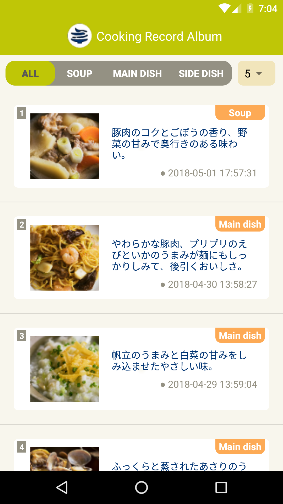
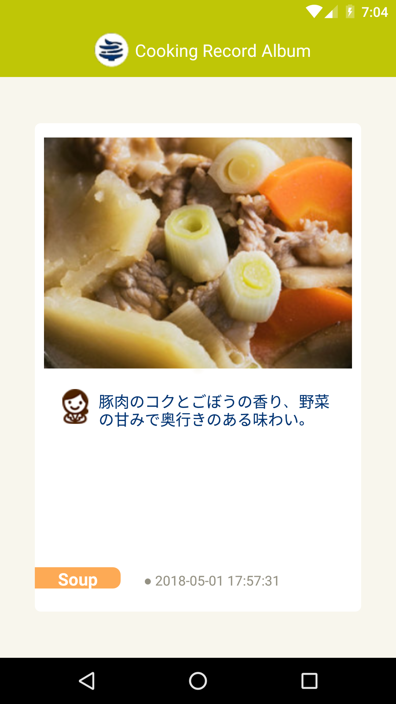

# Cooking Records Album

 &nbsp;&nbsp;

Prerequisites
--------------

- Android SDK v26.1.1
- JDK >= 1.8
- Latest Android Build Tools
- Android Support Repository

Getting started
---------------

This cooking-records-album uses the Gradle build system.

1. Download the source by cloning this repository or downloading an archived snapshot.\
   (See the options at the top of the page.)
2. On IntelliJ IDEA, create a new project and choose "Import FunRecipes Project" option.
3. Choose create from existing sources >> Next until finish
4. On the IntelliJ IDEA pop up at the right bottom choose 'Import Gradle Project'
5. Open IntelliJ IDEA terminal command through \FunRecipes folder path and type: **gradlew init**\
   (make sure it's the correct folder which contains gradlew with dir (windows) or ls (mac)
6. Open File > Invalidate Caches/Restart then select **Invalidate and Restart**
7. Wait for an indexing moment or Rebuild the project through: \
   Build > Rebuild Project if the IDE don't directly sync the project
8. Start your simulator and Run 'app'
